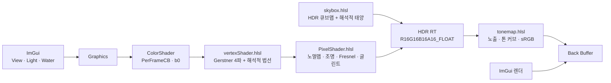

# WaterShader

> 엔진 없이 DirectX 11과 HLSL만으로 만든 물 셰이더입니다. 파도가 출렁이고, 하늘이 비치고, 햇빛이 물결 위에서 반짝입니다. 모든 값은 실행 중에 바로 바꿔 볼 수 있습니다.


## 프로젝트 개요

"진짜 물처럼 보이려면 무엇이 필요할까?"에서 출발한 프로젝트입니다. 언리얼이나 유니티 같은 엔진의 도움 없이 화면을 띄우는 일부터 직접 만들었고, 물이 그럴듯해 보이는 이유를 하나씩 셰이더로 옮겼습니다.

- **물의 모양**: 바다의 너울은 단순히 위아래로 흔들리지 않습니다. 물이 작은 원을 그리며 움직여서 마루는 뾰족하고 골은 넓어집니다. 이 움직임을 크기가 다른 파도 4개로 겹쳐 수면을 실제로 출렁이게 했습니다.
- **물의 질감**: 파도 위의 잔물결은 텍스처 두 장을 서로 다른 크기와 방향으로 흘려 표현했습니다.
- **물의 색과 반사**: 물은 위에서 내려다보면 속이 비치고, 멀리 비스듬히 보면 거울처럼 하늘을 비춥니다. 보는 각도에 따라 이 둘이 자연스럽게 바뀌도록 했습니다.
- **빛**: 실제 하늘을 찍은 HDR 사진에서 해의 위치, 햇빛의 색과 세기, 하늘빛을 재서 조명으로 그대로 옮겼습니다. 그래서 하늘을 바꾸면 물에 닿는 빛도 함께 바뀝니다.
- **화면에 담기**: 빛은 실제 밝기 그대로 계산하고, 마지막에 카메라처럼 노출을 맞춰 화면에 담습니다. 햇빛이 반사되는 아주 밝은 부분도 하얗게 뭉개지지 않습니다.

| 한눈에 보기 | |
|---|---|
| 분야 | 실시간 그래픽스 · 물 셰이더 |
| 핵심 기술 | 마루가 뾰족한 실제 바다 같은 파도(Gerstner 파도 4개 겹침). 보는 각도에 따라 물속과 하늘 반사가 바뀌는 표면(Fresnel). 햇빛이 물결마다 반짝이는 빛의 길(태양 글린트). 실제 하늘 사진에서 잰 빛으로 하는 조명(HDR 하늘). 밝은 부분까지 살리는 카메라식 노출(톤매핑) |
| 렌더 방식 | 가까이 놓고 보는 작은 물 평면과 지평선까지 펼쳐지는 바다, 두 가지로 볼 수 있습니다. 바다는 멀어질수록 격자를 듬성듬성하게 하고, 멀리 있는 작은 파도는 자연스럽게 잦아들게 해서 지평선이 지저분해지지 않게 했습니다. 하늘의 해는 셰이더가 직접 그려, 물에 비친 해와 하늘의 해가 같은 빛이 되게 했습니다 |
| 개발 도구 | 셰이더 파일을 저장하면 실행 중인 화면에 바로 반영됩니다. 숫자 키 1·2·3으로 여는 설정 창 세 개(보기·빛·물)에서 값을 바꿉니다. 같은 장면을 같은 시각에 자동으로 찍어 수정 전후를 나란히 비교하는 캡처 도구가 있습니다. 화면 구석에서 프레임 시간을 확인할 수 있습니다 |
| 상태 | 기본 기능 완성. 물보라(foam), 폭포 등은 계획 중 |

## 스크린샷

| | |
|---|---|
|  |  |
| **프리셋**: Basic / Sunset / Tropical (오션 그리드) | **업데이트 전후**: 2026-05 기존 버전 vs 2026-10 |
|  |  |
| **디버그 뷰**: 최종 / 노멀맵 / 월드 법선 / 조명 항 | **설정 창**: View [1] · Light [2] · Water [3] |

## 주요 기능

- **파도(기하학)**: Gerstner 파도 4개가 정점을 원운동시켜 마루는 뾰족하고 골은 넓게 만듭니다. 법선은 변위식을 미분해 해석적으로 계산합니다. 오션 그리드에서는 파장의 8~14배 거리에서 짧은 파도부터 사라지게 해 앨리어싱을 막습니다.
- **표면 디테일**: 노멀맵 2레이어(큰 잔물결 A, 작은 잔물결 B)를 whiteout blend로 합칩니다. 레이어마다 텍스처(5종)를 따로 고르고, 흐름 방향·속도와 크기를 조절합니다.
- **조명**: 태양 확산광(Lambert) + 하늘 ambient + 태양 글린트. 값은 E/π(Lambert 관례) 단위입니다. 태양을 하늘 텍스처·반사·Blinn-Phong에서 중복으로 더하지 않도록 **해석적 태양 하나**로 통일했습니다.
- **반사**: Schlick Fresnel(F0 0.02, 실제 물)로 하늘 큐브맵을 섞습니다. 수평선 아래로 꺾인 반사는 하늘 쪽으로 접어 지면이 비치지 않게 합니다.
- **태양 글린트**: `(n+2)/2 · pow(R·L, n)` 에너지 정규화 로브. Sharpness(n)를 바꿔도 반사되는 태양 에너지가 같아 강도 1이 물리값입니다.
- **하늘**: Poly Haven HDR을 BC6H 큐브맵으로 변환합니다(`tools/equirect_to_cube.ps1`). 변환 시 태양 원반을 잘라내고 태양·하늘 조도와 노출 기준값을 측정합니다. 원반은 스카이박스 셰이더가 같은 조도로 다시 그립니다.
- **리니어 / HDR / 톤매핑**: 색 입력(sRGB)은 linear로 변환해 계산하고, R16G16B16A16_FLOAT 타깃에 그린 뒤 노출(EV)과 톤 커브(None / Reinhard / ACES / ACES hue-preserving)를 적용해 sRGB로 출력합니다.
- **프리셋**: Basic(한낮 들판) / Sunset / Tropical. 하늘, 조명, 물, 파도, 노멀맵 조합, 노출을 `assets/shader_presets.txt`에 저장합니다.
- **디버그 뷰**: 최종 화면, 노멀맵, 월드 법선, UV, 앞/뒷면, 조명 항(R 확산 · G 스펙큘러 · B Fresnel)
- **캡처 도구**: 프리셋 3개 × 고정 샷 5개를 같은 시각(12초)으로 찍고, 단계별 비교 시트를 만듭니다. 무인 모드라 실행 중 키보드·마우스를 가로채지 않습니다.

## 구현 포인트



```text
셰이더 include 관계
Common.hlsli (cbuffer, VS/PS 입력 구조, WaveParams)
├── vertexShader.hlsl   (Gerstner 변위 + 법선, 거리 LOD)
└── PixelShader.hlsl
    ├── Lighting.hlsli  (Lambert, Schlick Fresnel, 글린트 로브)
    ├── Cubemap.hlsli   (TextureCube, 환경 샘플)
    └── Color.hlsli     (sRGB ↔ linear, 정확한 piecewise)
skybox.hlsl  — 별도 셰이더 (큐브맵 + 태양 원반)
tonemap.hlsl — 풀스크린 삼각형, 노출 · 톤 커브 · sRGB 인코딩 (Color.hlsli 사용)
```

- **리니어 워크플로**: 하늘 텍스처는 `_SRGB` SRV로 읽어 GPU가 필터링 전에 디코딩합니다. UI 색은 상수버퍼에 올릴 때 linear로 바꿉니다. 노멀맵은 데이터라 UNORM 그대로 둡니다. sRGB 인코딩은 톤매핑 패스에서 직접 합니다. 같은 백버퍼에 그리는 ImGui 색이 두 번 인코딩되지 않게 하려는 것입니다.
- **태양 단일화**: HDR 하늘에서 잘라낸 태양의 조도를 그대로 써서 확산광, 글린트, 하늘의 태양 원반(`E / Ω`)이 모두 같은 태양 하나에서 나옵니다.
- **해석적 법선**: 파도마다 변위의 편미분을 더해 법선을 만들어 마루·골에서 조명이 끊기지 않습니다.
- **안전한 핫 리로드**: 새 셰이더와 입력 레이아웃을 모두 만든 뒤에만 교체합니다. 컴파일에 실패하면 이전 셰이더로 계속 그리고 View 창에 오류를 띄웁니다.

## 업데이트 내역

### 2026-09 ~ 10

모든 작업은 기능 단위 브랜치로 나눠 진행했습니다. 무엇이 문제였고 어떻게 찾아서 고쳤는지는 수정 전후 캡처, 측정값과 함께 각 기록 문서에 남겼습니다.

#### 버그 수정

| 증상 | 원인과 해결 | 기록 |
|---|---|---|
| 물 표면 전체가 한쪽으로 기울어 보이고, 해를 수면 아래에 둬야 반사가 보임 | 노멀맵을 DDS로 변환할 때 사진용 색 보정(감마)이 잘못 적용돼, 평평해야 할 값 128이 55로 바뀌어 있었습니다. 색 변환 없이 다시 변환했습니다 | [water-polish](docs/features/water-polish/NOTES.md) |
| 해의 방향이 거꾸로 계산됨 | 위 버그와 서로 맞물려 그럭저럭 밝아 보이는 바람에 늦게 발견했습니다. 해의 위치를 방위각·고도로 다시 정의했습니다 | [water-polish](docs/features/water-polish/NOTES.md) |
| 물결 뒷면에 하늘 대신 땅이 비침 | 반사 방향이 수평선 아래로 꺾이는 경우를 하늘 쪽으로 접었습니다 | [water-polish](docs/features/water-polish/NOTES.md) |
| 자동 캡처 중 프로그램이 "응답 없음"으로 멈춤 | 기존 이미지를 덮어쓰는 순간 외부(보안 프로그램으로 추정)에서 프로세스를 통째로 정지시켰습니다. 기존 파일을 지운 뒤 새로 저장하도록 바꿨습니다 | [TROUBLESHOOTING A](docs/features/bench-tools/TROUBLESHOOTING.md) |
| JPG 노멀맵을 읽지 못함 | 예전엔 파일 형식 문제로 추정했지만, 실제로는 Windows의 이미지 로더(WIC)가 쓰는 COM이 초기화되지 않은 것이었습니다 | [TROUBLESHOOTING B](docs/features/bench-tools/TROUBLESHOOTING.md) |
| 한글 경로·라벨이 깨지고 빌드 경고(C4244) | 유니코드 문자열을 한 글자씩 잘라 변환하고 있었습니다. UTF-8 변환 함수로 바꿨습니다 | [TROUBLESHOOTING C](docs/features/bench-tools/TROUBLESHOOTING.md) |
| Sunset 물이 노을빛이 아니라 흙탕물처럼 보임 | 비치는 하늘이 붉지 않은 데다 물 색이 갈색 영역에 있었습니다. 노을 하늘을 따로 두고 물 색을 다시 잡았습니다 | [TROUBLESHOOTING D](docs/features/bench-tools/TROUBLESHOOTING.md) |
| 버튼을 누른 뒤 WASD로 카메라가 안 움직임 | UI의 키보드 탐색 기능이 키 입력을 가져가고 있었습니다 | [TROUBLESHOOTING E](docs/features/bench-tools/TROUBLESHOOTING.md) |
| 해가 두 번, 세 번 더해져 너무 밝음 | 하늘 사진 속 해, 반짝임, 하이라이트가 같은 해를 각각 더하고 있었습니다. 하늘에서 해를 잘라내고 셰이더가 그리는 해 하나로 합쳤습니다 | [hdr-env](docs/features/hdr-env/NOTES.md) |
| Capture 버튼을 실수로 누르면 기록이 덮어써질 위험 | 확인 창을 띄우고, 같은 이름의 폴더가 있으면 번호를 붙여 새로 만들도록 했습니다 | [hdr-env](docs/features/hdr-env/NOTES.md) |
| Basic 바다에 노을의 붉은빛이 섞임 | Basic 하늘 자체가 노을 사진이었습니다. 한낮 들판 하늘로 바꿨습니다 | [basic-sky](docs/features/basic-sky/NOTES.md) |
| 잔물결 흐름 속도의 부호가 실제 흐르는 방향과 반대 | 텍스처를 읽는 위치를 밀면 무늬는 반대로 움직여 보입니다. UI에서 실제 흐르는 방향과 속도로 보여주도록 바꿨습니다 | [ui-panels](docs/features/ui-panels/NOTES.md) |

#### 퀄리티 업

| 내용 | 기록 |
|---|---|
| **물 표현**: 햇빛이 물결마다 반짝이는 빛의 길, 크기가 다른 잔물결 두 겹, 실제 물에 맞춘 반사율, 위아래로만 흔들리던 파도 2개를 마루가 뾰족한 파도 4개로 교체, 지평선까지 이어지는 바다 | [water-polish](docs/features/water-polish/NOTES.md) |
| **작업 도구**: 마우스로 평면 돌리기와 시점 회전, 같은 구도를 다시 찾는 카메라 위치 5개와 저장 슬롯, 프레임 시간 표시, 프리셋마다 다른 하늘 | [bench-tools](docs/features/bench-tools/NOTES.md) |
| **빛 계산 방식**: 빛을 실제 밝기 그대로 더하는 방식(리니어)으로 바꾸고, 밝은 부분까지 담는 노출과 톤매핑을 넣었습니다. 자동 캡처가 작업 중인 키보드·마우스를 가로채지 않게 했습니다 | [linear-hdr](docs/features/linear-hdr/NOTES.md) |
| **하늘과 조명**: 실제 밝기가 담긴 HDR 하늘로 바꾸고, 그 하늘에서 해의 위치·색·세기와 하늘빛을 재서 조명으로 옮겼습니다 | [hdr-env](docs/features/hdr-env/NOTES.md) |
| **Basic 하늘**: 한낮 들판 하늘(belfast_farmhouse) | [basic-sky](docs/features/basic-sky/NOTES.md) |
| **잔물결 텍스처 선택**: 5종 중 두 겹을 따로 골라 프리셋에 저장 | [normal-select](docs/features/normal-select/NOTES.md) |
| **설정 화면 정리**: 한 창에 몰려 있던 설정을 보기·빛·물 세 창으로 나눴습니다(키 1·2·3). 처음 보는 사람도 알 수 있는 이름으로 바꾸고, 파도가 화면에서 어느 쪽으로 가는지 보여주는 방향 표시를 넣었습니다 | [ui-panels](docs/features/ui-panels/NOTES.md) |

### 2026-05 — 기존 버전

DirectX 11 기반 구축(dx11-setup, shader-hot-reload, asset-pipeline), 조명(scene-lighting), 큐브맵(env-cubemap), Sine wave 수면(water-base), 노멀맵(water-normal-map).

## 빌드와 실행

**요구 환경**: Windows 10/11, Visual Studio 2022 (C++ 데스크톱 개발), CMake 3.24+, [vcpkg](https://github.com/microsoft/vcpkg) (manifest 모드)

**의존성** (`vcpkg.json`에서 자동 설치):
- [DirectXTK](https://github.com/microsoft/DirectXTK) — DDS/WIC 텍스처 로더
- [Dear ImGui](https://github.com/ocornut/imgui) — `win32-binding`, `dx11-binding`
- [tinyobjloader](https://github.com/tinyobjloader/tinyobjloader) — OBJ 파서

```powershell
git clone https://github.com/ryuhajin/WaterShader.git
cd WaterShader
$env:VCPKG_ROOT = "C:\path\to\vcpkg"      # vcpkg 설치 경로
cmake --preset vs2022
cmake --build --preset vs2022-debug       # Release는 vs2022-release
.\build\vs2022\Debug\WaterShader.exe
```

- 빌드 후 셰이더와 `assets/`가 실행 파일 옆으로 복사됩니다.
- **핫 리로드**: `shaders/`의 `.hlsl`/`.hlsli`를 저장하면 200ms 안에 다시 컴파일합니다. Debug 빌드는 소스 `shaders/`와 `assets/`를 직접 쓰고, Release 빌드는 실행 파일 옆 복사본을 읽습니다.
- Debug 빌드에서 `Save Current`를 누르면 저장소의 `assets/shader_presets.txt`가 바뀝니다.

**명령줄 옵션** (캡처·측정용)

| 옵션 | 동작 |
|---|---|
| `--capture <label>` | 프리셋 3개 × 고정 샷 5개를 저장하고 종료 (무인 모드 포함) |
| `--capture-feature <name>` | 저장 위치 `docs/features/<name>/captures/<label>/` |
| `--debug <0-5>` | 캡처할 디버그 뷰 |
| `--shot <name>` | 시작 카메라 샷 (`oblique`, `top`, `sunward`, `ocean_sunward`, `ocean_wide`) |
| `--ui <view\|light\|water\|all>` | 설정 창을 연 상태로 시작 |
| `--normal-a <i>` / `--normal-b <i>` | 레이어별 노멀맵을 프리셋 대신 지정 |
| `--normal-map <path>` | 추가 노멀맵 파일(두 레이어에 적용) |
| `--tonemap <none\|reinhard\|aces\|aces-hue>`, `--exposure <ev>` | 톤 커브·노출 덮어쓰기 |
| `--no-vsync` | FPS 제한 해제 (성능 측정) |
| `--no-input` | 무인 모드: 포커스를 가져가지 않고 키보드·마우스 입력을 무시 |

## 조작

| 입력 | 동작 |
|---|---|
| `W` / `S`, `A` / `D`, `E` / `Q` | 카메라 앞·뒤, 왼쪽·오른쪽, 위·아래 이동 |
| `←` `→` / `↑` `↓` | 카메라 좌우 / 상하 회전 |
| 마우스 왼쪽 드래그 | 벤치 평면 회전 (오션 그리드에서는 시점 회전) |
| 마우스 오른쪽 드래그 | 시점 회전 |
| `1` / `2` / `3` | View / Light / Water 설정 창 열기·닫기 |
| `Esc` | 종료 |

| 창 | 섹션 |
|---|---|
| **View Settings [1]** | Presets(Apply / Save Current), Camera, Camera Presets(고정 샷 5개 + 슬롯 4개), Scene(Ocean Grid, Skybox), Capture, Debug View |
| **Light Settings [2]** | Sky / Environment(하늘 선택, Calibrate From Sky), Sun(방향·색·세기), Sun Glint, Ambient, Tonemapping(커브·노출) |
| **Water Settings [3]** | Water Color, Reflection, Normal Map(레이어 A/B: 텍스처·크기·흐름), Waves(파도 4개: 방향·높이·길이·속도·뾰족함) |

좌측 상단 Stats에는 FPS, CPU/GPU 시간, VSync 토글, 단축키 안내가 표시됩니다.

## 프로젝트 구조

```text
WaterShader/
├─ src/          # C++: D3D11·HDR 타깃, Graphics(UI·카메라·프리셋·캡처), ColorShader/SkyboxShader/TonemapShader(핫 리로드), GpuTimer, 로더
├─ shaders/      # HLSL: vertexShader, PixelShader, skybox, tonemap과 Common/Lighting/Cubemap/Color 헤더
├─ assets/
│  ├─ models/    # 32x32Plane.obj (벤치 평면)
│  ├─ textures/  # env_*_hdr.dds(HDR 하늘, BC6H), env_*.dds·skybox.dds(LDR 하늘), water_normal*.dds(노멀맵 5종)
│  ├─ shader_presets.txt   # 프리셋 3개
│  └─ camera_presets.txt   # 카메라 슬롯
├─ tools/        # equirect_to_cube.ps1 — 파노라마(.jpg/.hdr) → 큐브맵 DDS + 태양·하늘 측정
├─ docs/         # 개요, 로드맵, 작업 규칙, 결정 기록, 기능별 SPEC/NOTES, README 이미지
├─ CMakePresets.json
└─ vcpkg.json
```

## 문서

- [프로젝트 개요](docs/OVERVIEW.md) — 목적과 평가 포인트
- [로드맵](docs/ROADMAP.md) — 일정, 완료 목록, 앞으로 할 일
- [작업 규칙](docs/CONVENTIONS.md) — 문서 규칙과 기능 단위 브랜치 워크플로
- [기술 결정 기록](docs/decisions.md)
- [기능별 SPEC / NOTES](docs/features/) — 2026-05: dx11-setup, shader-hot-reload, asset-pipeline, scene-lighting, env-cubemap, water-base, water-normal-map, foam-mask / 2026-10: water-polish, bench-tools, linear-hdr, hdr-env, basic-sky, normal-select, ui-panels

### 향후 계획

- **Foam mask**: 파도 마루의 흰 거품 (`feature/foam-mask` 브랜치에서 진행 중)
- **Waterfall**: 폭포 리본 메시와 가장자리 거품
- **Ripple SDF**: 시간에 따라 퍼지는 원형 물결
- **UE5 포팅**

자세한 우선순위는 [로드맵](docs/ROADMAP.md)의 Post-deadline 섹션을 참고하세요.

## 참고 자료

- Schlick approximation (Fresnel) — *Real-Time Rendering* 4th, Ch. 9
- [GPU Gems Ch.1 — Effective Water Simulation from Physical Models](https://developer.nvidia.com/gpugems/gpugems/part-i-natural-effects/chapter-1-effective-water-simulation-physical-models) (Gerstner 파도, 법선)
- [Catlike Coding — Waves](https://catlikecoding.com/unity/tutorials/flow/waves/)
- [Krzysztof Narkowicz — ACES Filmic Tone Mapping Curve](https://knarkowicz.wordpress.com/2016/01/06/aces-filmic-tone-mapping-curve/)
- [DirectXTK Wiki](https://github.com/microsoft/DirectXTK/wiki)

## 에셋 출처

- **물 노멀맵** (`assets/textures/water_normal*.jpg`, 변환본 `.dds`) — [CADhatch Seamless Water Textures](https://www.cadhatch.com/seamless-water-textures) (무료 seamless 텍스처)
- **하늘 HDRI** (`assets/textures/env_*.dds`) — [Poly Haven](https://polyhaven.com/hdris) (CC0): `belfast_farmhouse`, `grasslands_sunset`, `the_sky_is_on_fire`, `spiaggia_di_mondello`
