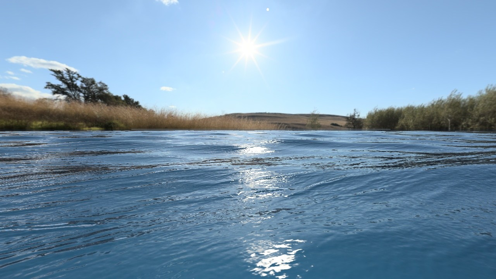
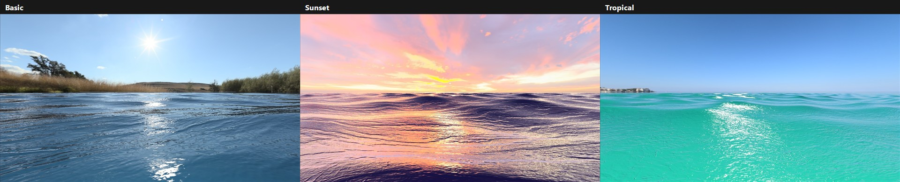
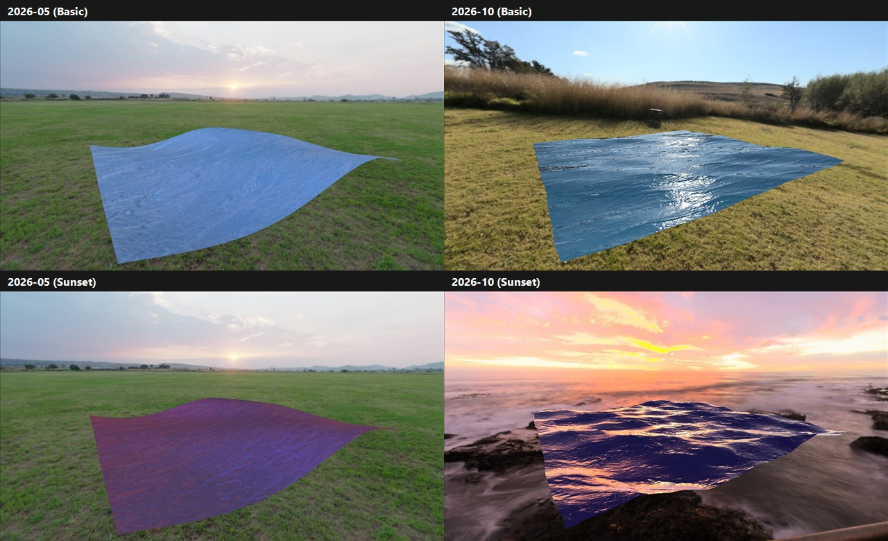
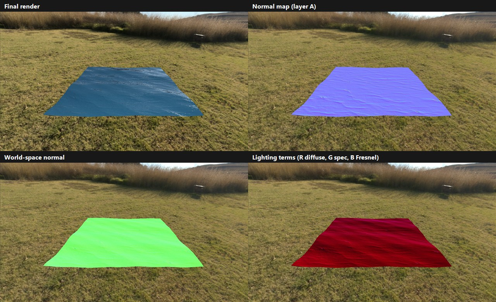
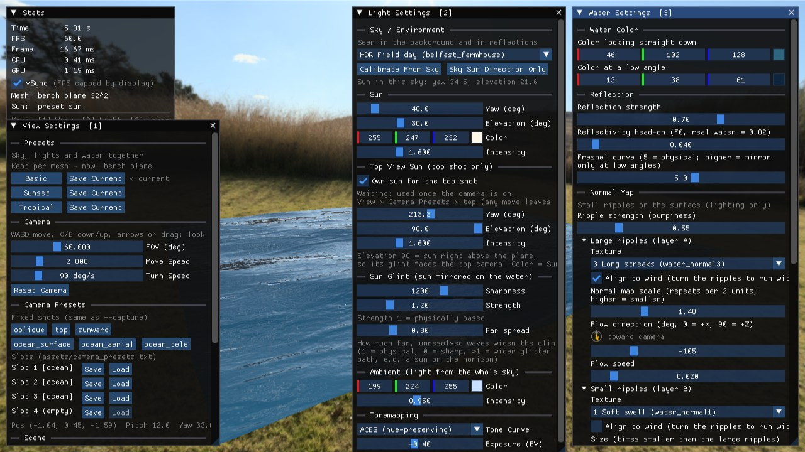
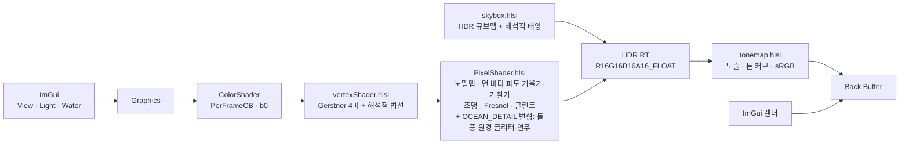

# WaterShader

> DirectX 11과 HLSL로 만든 물 셰이더입니다.


**프로젝트 페이지** · [ryuhajin.github.io/projects/water-shader](https://ryuhajin.github.io/projects/water-shader/) &nbsp;|&nbsp; **시연 영상** · [YouTube](https://youtu.be/hAdJnM9oWXo)



## 프로젝트 개요

Gerstner 파도, 두 겹의 노멀맵 잔물결, HDR 하늘 반사로 잔잔한 호수부터 노을 진 바다까지 그리는 DirectX 11 물 셰이더입니다.
바람·파도·빛을 ImGui 설정 창에서 바로 조절하고, 3가지 테마 프리셋으로 저장·비교할 수 있습니다.

| 한눈에 보기 | |
|---|---|
| 분야 | 실시간 렌더링 · 물 표면 셰이딩 |
| 파도 | Gerstner 파도 4개(값 20개)를 바람 방향·퍼짐·크기·높이·거칠기·속도 슬라이더 6개로 묶어 생성 |
| 바다 | 1024² 그리드(정점 약 105만). 원경은 메시 → 픽셀 노멀 → 표면 거칠기로 이어 수평선까지 표현 |
| 잔물결 | 노멀맵 5종 중 2장을 골라 서로 다른 크기·방향으로 흘려 겹침, 바람 방향과 1° 이내로 정렬 |
| 빛 | 리니어 HDR(RGBA16F) 렌더링, HDR 하늘에서 측정한 해의 방향·색·밝기, Fresnel 반사, 톤 매핑 4종 |
| 개발 도구 | View / Light / Water 설정 창, 테마 프리셋 3종, 디버그 뷰, 셰이더 핫 리로드, 명령줄 캡처 |
| 성능 | 오션 그리드 GPU 약 0.2 ms (Release, 1280×720) |

## 스크린샷

| | |
|---|---|
|  |  |
| **프리셋**: Basic / Sunset / Tropical (오션 그리드) | **업데이트 전후**: 2026-05 기존 버전 vs 2026-10 |
|  |  |
| **디버그 뷰**: 최종 / 노멀맵 / 월드 법선 / 조명 항 | **설정 창**: View [1] · Light [2] · Water [3] |

## 빌드와 실행

**요구 환경**: Windows 10/11, Visual Studio 2022 (C++ 데스크톱 개발), CMake 3.24+, [vcpkg](https://github.com/microsoft/vcpkg) (manifest 모드)

**의존성** (`vcpkg.json`에서 자동 설치): [DirectXTK](https://github.com/microsoft/DirectXTK) (DDS/WIC 로더), [Dear ImGui](https://github.com/ocornut/imgui) (win32/dx11 바인딩), [tinyobjloader](https://github.com/tinyobjloader/tinyobjloader) (OBJ 파서)

```powershell
git clone https://github.com/ryuhajin/WaterShader.git
cd WaterShader
$env:VCPKG_ROOT = "C:\path\to\vcpkg"      # vcpkg 설치 경로
cmake --preset vs2022
cmake --build --preset vs2022-debug       # Release는 vs2022-release
.\build\vs2022\Debug\WaterShader.exe
```

- 빌드 후 셰이더와 `assets/`가 실행 파일 옆으로 복사됩니다.
- **핫 리로드**: `shaders/`의 `.hlsl`/`.hlsli`를 저장하면 200ms 안에 다시 컴파일합니다. Debug 빌드는 소스 `shaders/`와 `assets/`를 직접 쓰고, Release 빌드는 실행 파일 옆 복사본을 읽습니다.
- Debug 빌드에서 `Save Current`를 누르면 저장소의 `assets/shader_presets.txt`가 바뀝니다. 프리셋은 작은 평면과 오션 그리드에 따로 저장되고, `Save Current`는 지금 보고 있는 평면 쪽에 저장합니다.

## 조작

| 입력 | 동작 |
|---|---|
| `W` / `S`, `A` / `D`, `E` / `Q` | 카메라 앞·뒤, 왼쪽·오른쪽, 위·아래 이동 |
| `←` `→` / `↑` `↓` | 카메라 좌우 / 상하 회전 |
| 마우스 왼쪽 드래그 | 벤치 평면 회전 (오션 그리드에서는 시점 회전) |
| 마우스 오른쪽 드래그 | 시점 회전 |
| `1` / `2` / `3` | View / Light / Water 설정 창 열기·닫기 |
| `Esc` | 종료 |

| 창 | 섹션 |
|---|---|
| **View Settings [1]** | Presets(Apply / Save Current), Camera, Camera Presets(고정 샷 7개 + 슬롯 4개), Scene(Ocean Grid, Skybox), Capture, Debug View |
| **Light Settings [2]** | Sky / Environment(하늘 선택, Calibrate From Sky), Sun(방향·색·세기), Sun Glint(날카로움·세기·먼 바다 확산 Far spread), Ambient, Tonemapping(커브·노출) |
| **Water Settings [3]** | Water Color, Reflection, Normal Map(레이어 A/B: 텍스처·바람 정렬·크기·흐름), Ocean Detail(먼 파도 마루·원경 리플 글리터·돌풍 패치·수평선 연무), Waves(Simple: 바람 방향·퍼짐·크기·높이·거칠기·속도로 파도 4개 생성 / Advanced: 파도 4개 개별 조정 / Far waves 토글) |

좌측 상단 Stats에는 FPS, CPU/GPU 시간, VSync 토글, 단축키 안내가 표시됩니다.

## 프로젝트 구조

```text
WaterShader/
├─ src/          # C++: D3D11·HDR 타깃, Graphics(UI·카메라·프리셋·캡처), 셰이더 래퍼(핫 리로드), GpuTimer, 로더
├─ shaders/      # vertexShader, PixelShader, skybox, tonemap + 공용 헤더 Common/Lighting/Cubemap/Color/Waves.hlsli
├─ assets/       # 벤치 평면 OBJ, 하늘(HDR BC6H)·노멀맵 5종 DDS, 프리셋·카메라 슬롯 txt
├─ tools/        # equirect_to_cube.ps1 — 파노라마 → 큐브맵 DDS + 태양·하늘 측정
│                # measure_normal_orientation.ps1 — 노멀맵 무늬 방향 측정 (Align to wind용)
├─ tests/        # wave_macro_test.cpp — Simple 파도 생성 규칙 검사 (WaveMacroTest)
└─ docs/         # 개요, 로드맵, 작업 규칙, 결정 기록, 기능별 SPEC/NOTES
```

## 구현 상세



## 업데이트 내역

2026-09 ~ 10에 진행한 버그 수정 23건과 퀄리티 업 19건은 [업데이트 내역](docs/CHANGELOG.md)에 증상·원인·해결과 기록 문서 링크로 정리했습니다.

## 문서

- [프로젝트 개요](docs/OVERVIEW.md) — 목적과 평가 포인트
- [로드맵](docs/ROADMAP.md) — 일정, 완료 목록, 앞으로 할 일
- [작업 규칙](docs/CONVENTIONS.md) — 문서 규칙과 기능 단위 브랜치 워크플로
- [기술 결정 기록](docs/decisions.md)
- [업데이트 내역](docs/CHANGELOG.md) — 버그 수정·퀄리티 업 기록
- [기능별 SPEC / NOTES](docs/features/)

## 참고 자료

- Schlick approximation (Fresnel) — *Real-Time Rendering* 4th, Ch. 9
- [GPU Gems Ch.1 — Effective Water Simulation from Physical Models](https://developer.nvidia.com/gpugems/gpugems/part-i-natural-effects/chapter-1-effective-water-simulation-physical-models) (Gerstner 파도, 법선)
- [Catlike Coding — Waves](https://catlikecoding.com/unity/tutorials/flow/waves/)
- Bruneton et al., *Real-time Realistic Ocean Lighting using Seamless Transitions from Geometry to BRDF*, 2010 (원경 거칠기)
- [Krzysztof Narkowicz — ACES Filmic Tone Mapping Curve](https://knarkowicz.wordpress.com/2016/01/06/aces-filmic-tone-mapping-curve/)
- [DirectXTK Wiki](https://github.com/microsoft/DirectXTK/wiki)

## 에셋 출처

- **물 노멀맵** (`assets/textures/water_normal*.jpg`, 변환본 `.dds`) — [CADhatch Seamless Water Textures](https://www.cadhatch.com/seamless-water-textures) (무료 seamless 텍스처)
- **하늘 HDRI** (`assets/textures/env_*.dds`) — [Poly Haven](https://polyhaven.com/hdris) (CC0): `belfast_farmhouse`, `grasslands_sunset`, `the_sky_is_on_fire`, `spiaggia_di_mondello`
