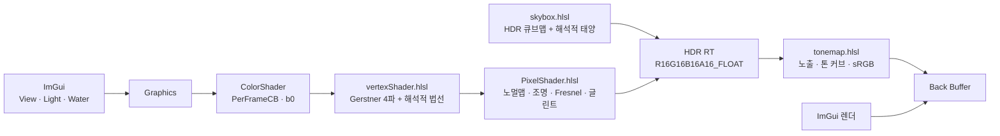

# WaterShader

> 엔진이나 머티리얼 그래프 없이 DirectX 11 + raw HLSL로 작성한 수면 셰이더. 리니어 HDR 파이프라인, HDR 하늘에서 측정한 조명, Gerstner 파도. 모든 파라미터를 ImGui로 실시간 조절


## 프로젝트 개요

정점 셰이더의 Gerstner 파도 4개로 수면 형태를 만들고, 픽셀 셰이더에서 두 겹의 노멀맵, 태양·하늘 조명, Fresnel 반사, 태양 글린트로 질감을 표현하는 포트폴리오 프로젝트입니다.
조명은 **리니어 공간 + float16 HDR 렌더 타깃**에서 계산하고, 마지막 패스에서 노출·톤매핑·sRGB 인코딩을 한 번만 합니다.
하늘은 HDR 원본(.hdr → BC6H 큐브맵)을 쓰고, 그 하늘에서 태양 방향·색·조도와 하늘 ambient를 측정해 조명값으로 연결했습니다.
외부 엔진 없이 DirectX 11 초기화, 메시·텍스처 로딩, 상수버퍼, 셰이더 핫 리로드, 캡처·비교 도구를 직접 만들었습니다.

| 한눈에 보기 | |
|---|---|
| 분야 | 실시간 셰이더 · 수면 렌더링 |
| 핵심 기술 | Gerstner 파도 4개 + 거리 LOD, 레이어별 노멀맵(whiteout blend), Schlick Fresnel(F0 = 0.02), 에너지 정규화 태양 글린트, 리니어 워크플로 + HDR + 톤매핑(hue-preserving ACES), HDR 큐브맵 + 하늘 기반 조명 보정 |
| 렌더 방식 | 벤치 평면(OBJ 32²) / 오션 그리드(1024², 지수 간격) + VS/PS, 큐브맵 스카이박스 + 해석적 태양 원반, 풀스크린 톤매핑 패스 |
| 개발 도구 | 셰이더 핫 리로드, View / Light / Water 설정 창(키 1·2·3), 고정 샷 캡처 + before/after 비교 시트, GPU 타이머 Stats, 무인 실행 모드 |
| 상태 | 퀄리티업 완료(2026-10). 거품(foam) 등은 향후 계획 |

## 스크린샷

| | |
|---|---|
|  |  |
| **프리셋**: Basic / Sunset / Tropical (오션 그리드) | **업데이트 전후**: 2026-05 마감 버전 vs 2026-10 |
|  |  |
| **디버그 뷰**: 최종 / 노멀맵 / 월드 법선 / 조명 항 | **설정 창**: View [1] · Light [2] · Water [3] |

## 주요 기능

- **파도(기하학)**: Gerstner 파도 4개가 정점을 원운동시켜 마루는 뾰족하고 골은 넓게 만듭니다. 법선은 변위식을 미분해 해석적으로 계산합니다. 오션 그리드에서는 파장의 8~14배 거리에서 짧은 파도부터 사라지게 해 앨리어싱을 막습니다.
- **표면 디테일**: 노멀맵 2레이어(큰 잔물결 A, 작은 잔물결 B)를 whiteout blend로 합칩니다. 레이어마다 텍스처(5종)를 따로 고르고, 흐름 방향·속도와 크기를 조절합니다.
- **조명**: 태양 확산광(Lambert) + 하늘 ambient + 태양 글린트. 값은 E/π(Lambert 관례) 단위입니다. 태양을 하늘 텍스처·반사·Blinn-Phong에서 중복으로 더하지 않도록 **해석적 태양 하나**로 통일했습니다.
- **반사**: Schlick Fresnel(F0 0.02, 실제 물)로 하늘 큐브맵을 섞습니다. 수평선 아래로 꺾인 반사는 하늘 쪽으로 접어 지면이 비치지 않게 합니다.
- **태양 글린트**: `(n+2)/2 · pow(R·L, n)` 에너지 정규화 로브. Sharpness(n)를 바꿔도 반사되는 태양 에너지가 같아 강도 1이 물리값입니다.
- **하늘**: Poly Haven HDR을 BC6H 큐브맵으로 변환합니다(`tools/equirect_to_cube.ps1`). 변환 시 태양 원반을 잘라내고 태양·하늘 조도와 노출 기준값을 측정합니다. 원반은 스카이박스 셰이더가 같은 조도로 다시 그립니다.
- **리니어 / HDR / 톤매핑**: 색 입력(sRGB)은 linear로 변환해 계산하고, R16G16B16A16_FLOAT 타깃에 그린 뒤 노출(EV)과 톤 커브(None / Reinhard / ACES / ACES hue-preserving)를 적용해 sRGB로 출력합니다.
- **프리셋**: Basic(한낮 들판) / Sunset / Tropical. 하늘, 조명, 물, 파도, 노멀맵 조합, 노출을 `assets/shader_presets.txt`에 저장합니다.
- **디버그 뷰**: 최종 화면, 노멀맵, 월드 법선, UV, 앞/뒷면, 조명 항(R 확산 · G 스펙큘러 · B Fresnel)
- **캡처 도구**: 프리셋 3개 × 고정 샷 5개를 같은 시각(12초)으로 찍고, 단계별 비교 시트를 만듭니다. 무인 모드라 실행 중 키보드·마우스를 가로채지 않습니다.

## 구현 포인트



```text
셰이더 include 관계
Common.hlsli (cbuffer, VS/PS 입력 구조, WaveParams)
├── vertexShader.hlsl   (Gerstner 변위 + 법선, 거리 LOD)
└── PixelShader.hlsl
    ├── Lighting.hlsli  (Lambert, Schlick Fresnel, 글린트 로브)
    ├── Cubemap.hlsli   (TextureCube, 환경 샘플)
    └── Color.hlsli     (sRGB ↔ linear, 정확한 piecewise)
skybox.hlsl  — 별도 셰이더 (큐브맵 + 태양 원반)
tonemap.hlsl — 풀스크린 삼각형, 노출 · 톤 커브 · sRGB 인코딩 (Color.hlsli 사용)
```

- **리니어 워크플로**: 하늘 텍스처는 `_SRGB` SRV로 읽어 GPU가 필터링 전에 디코딩합니다. UI 색은 상수버퍼에 올릴 때 linear로 바꿉니다. 노멀맵은 데이터라 UNORM 그대로 둡니다. sRGB 인코딩은 톤매핑 패스에서 직접 합니다. 같은 백버퍼에 그리는 ImGui 색이 두 번 인코딩되지 않게 하려는 것입니다.
- **태양 단일화**: HDR 하늘에서 잘라낸 태양의 조도를 그대로 써서 확산광, 글린트, 하늘의 태양 원반(`E / Ω`)이 모두 같은 태양 하나에서 나옵니다.
- **해석적 법선**: 파도마다 변위의 편미분을 더해 법선을 만들어 마루·골에서 조명이 끊기지 않습니다.
- **안전한 핫 리로드**: 새 셰이더와 입력 레이아웃을 모두 만든 뒤에만 교체합니다. 컴파일에 실패하면 이전 셰이더로 계속 그리고 View 창에 오류를 띄웁니다.

## 업데이트 내역

### 2026-10 — 포트폴리오 퀄리티업

feature 브랜치 단위로 진행했고, 각 기능마다 문제 원인·해결 과정·검증 수치를 before/after 캡처와 함께 기록했습니다.

| 기능 | 내용 | 기록 |
|---|---|---|
| water-polish | 노멀맵 감마 버그·태양 방향 반전 수정, 태양 글린트, 2-scale whiteout 노멀, Fresnel F0, Sine 2개 → Gerstner 4개, 오션 그리드 + 거리 LOD | [NOTES](docs/features/water-polish/NOTES.md) |
| bench-tools | 마우스 드래그 회전·시점, 카메라 고정 샷·슬롯, 프리셋별 하늘, Stats(GPU 타이머), COM 초기화·C4244 수정 | [NOTES](docs/features/bench-tools/NOTES.md) |
| linear-hdr | 리니어 워크플로, float16 HDR 렌더 타깃, 노출 + 톤 커브 4종, 무인 실행 모드 | [NOTES](docs/features/linear-hdr/NOTES.md) |
| hdr-env | HDR 하늘(BC6H), 태양 분리 + 하늘에서 조명 측정·보정, 에너지 정규화 글린트, Blinn-Phong 제거 | [NOTES](docs/features/hdr-env/NOTES.md) |
| basic-sky | Basic 하늘을 노을에서 한낮 들판 HDR로 교체(반사의 붉은 기운 제거) | [NOTES](docs/features/basic-sky/NOTES.md) |
| normal-select | 노멀맵 5종, 레이어 A/B를 따로 선택해 프리셋에 저장 | [NOTES](docs/features/normal-select/NOTES.md) |
| ui-panels | 설정 UI를 View / Light / Water 창으로 분리(키 1·2·3), 초보자용 이름·흐름 방향·파도 방향 다이얼 | [NOTES](docs/features/ui-panels/NOTES.md) |

### 2026-05 — 마감 버전

DirectX 11 기반 구축(dx11-setup, shader-hot-reload, asset-pipeline), 조명(scene-lighting), 큐브맵(env-cubemap), Sine wave 수면(water-base), 노멀맵(water-normal-map).

## 빌드와 실행

**요구 환경**: Windows 10/11, Visual Studio 2022 (C++ 데스크톱 개발), CMake 3.24+, [vcpkg](https://github.com/microsoft/vcpkg) (manifest 모드)

**의존성** (`vcpkg.json`에서 자동 설치):
- [DirectXTK](https://github.com/microsoft/DirectXTK) — DDS/WIC 텍스처 로더
- [Dear ImGui](https://github.com/ocornut/imgui) — `win32-binding`, `dx11-binding`
- [tinyobjloader](https://github.com/tinyobjloader/tinyobjloader) — OBJ 파서

```powershell
git clone https://github.com/ryuhajin/WaterShader.git
cd WaterShader
$env:VCPKG_ROOT = "C:\path\to\vcpkg"      # vcpkg 설치 경로
cmake --preset vs2022
cmake --build --preset vs2022-debug       # Release는 vs2022-release
.\build\vs2022\Debug\WaterShader.exe
```

- 빌드 후 셰이더와 `assets/`가 실행 파일 옆으로 복사됩니다.
- **핫 리로드**: `shaders/`의 `.hlsl`/`.hlsli`를 저장하면 200ms 안에 다시 컴파일합니다. Debug 빌드는 소스 `shaders/`와 `assets/`를 직접 쓰고, Release 빌드는 실행 파일 옆 복사본을 읽습니다.
- Debug 빌드에서 `Save Current`를 누르면 저장소의 `assets/shader_presets.txt`가 바뀝니다.

**명령줄 옵션** (캡처·측정용)

| 옵션 | 동작 |
|---|---|
| `--capture <label>` | 프리셋 3개 × 고정 샷 5개를 저장하고 종료 (무인 모드 포함) |
| `--capture-feature <name>` | 저장 위치 `docs/features/<name>/captures/<label>/` |
| `--debug <0-5>` | 캡처할 디버그 뷰 |
| `--shot <name>` | 시작 카메라 샷 (`oblique`, `top`, `sunward`, `ocean_sunward`, `ocean_wide`) |
| `--ui <view\|light\|water\|all>` | 설정 창을 연 상태로 시작 |
| `--normal-a <i>` / `--normal-b <i>` | 레이어별 노멀맵을 프리셋 대신 지정 |
| `--normal-map <path>` | 추가 노멀맵 파일(두 레이어에 적용) |
| `--tonemap <none\|reinhard\|aces\|aces-hue>`, `--exposure <ev>` | 톤 커브·노출 덮어쓰기 |
| `--no-vsync` | FPS 제한 해제 (성능 측정) |
| `--no-input` | 무인 모드: 포커스를 가져가지 않고 키보드·마우스 입력을 무시 |

## 조작

| 입력 | 동작 |
|---|---|
| `W` / `S`, `A` / `D`, `E` / `Q` | 카메라 앞·뒤, 왼쪽·오른쪽, 위·아래 이동 |
| `←` `→` / `↑` `↓` | 카메라 좌우 / 상하 회전 |
| 마우스 왼쪽 드래그 | 벤치 평면 회전 (오션 그리드에서는 시점 회전) |
| 마우스 오른쪽 드래그 | 시점 회전 |
| `1` / `2` / `3` | View / Light / Water 설정 창 열기·닫기 |
| `Esc` | 종료 |

| 창 | 섹션 |
|---|---|
| **View Settings [1]** | Presets(Apply / Save Current), Camera, Camera Presets(고정 샷 5개 + 슬롯 4개), Scene(Ocean Grid, Skybox), Capture, Debug View |
| **Light Settings [2]** | Sky / Environment(하늘 선택, Calibrate From Sky), Sun(방향·색·세기), Sun Glint, Ambient, Tonemapping(커브·노출) |
| **Water Settings [3]** | Water Color, Reflection, Normal Map(레이어 A/B: 텍스처·크기·흐름), Waves(파도 4개: 방향·높이·길이·속도·뾰족함) |

좌측 상단 Stats에는 FPS, CPU/GPU 시간, VSync 토글, 단축키 안내가 표시됩니다.

## 프로젝트 구조

```text
WaterShader/
├─ src/          # C++: D3D11·HDR 타깃, Graphics(UI·카메라·프리셋·캡처), ColorShader/SkyboxShader/TonemapShader(핫 리로드), GpuTimer, 로더
├─ shaders/      # HLSL: vertexShader, PixelShader, skybox, tonemap과 Common/Lighting/Cubemap/Color 헤더
├─ assets/
│  ├─ models/    # 32x32Plane.obj (벤치 평면)
│  ├─ textures/  # env_*_hdr.dds(HDR 하늘, BC6H), env_*.dds·skybox.dds(LDR 하늘), water_normal*.dds(노멀맵 5종)
│  ├─ shader_presets.txt   # 프리셋 3개
│  └─ camera_presets.txt   # 카메라 슬롯
├─ tools/        # equirect_to_cube.ps1 — 파노라마(.jpg/.hdr) → 큐브맵 DDS + 태양·하늘 측정
├─ docs/         # 개요, 로드맵, 작업 규칙, 결정 기록, 기능별 SPEC/NOTES, README 이미지
├─ CMakePresets.json
└─ vcpkg.json
```

## 문서

- [프로젝트 개요](docs/OVERVIEW.md) — 목적과 평가 포인트
- [로드맵](docs/ROADMAP.md) — 일정, 완료 목록, 마감 이후 backlog
- [작업 규칙](docs/CONVENTIONS.md) — 문서 규칙과 기능 단위 브랜치 워크플로
- [기술 결정 기록](docs/decisions.md)
- [기능별 SPEC / NOTES](docs/features/) — 2026-05: dx11-setup, shader-hot-reload, asset-pipeline, scene-lighting, env-cubemap, water-base, water-normal-map, foam-mask / 2026-10: water-polish, bench-tools, linear-hdr, hdr-env, basic-sky, normal-select, ui-panels

### 향후 계획

- **Foam mask**: 파도 마루의 흰 거품 (`feature/foam-mask` 브랜치에서 진행 중)
- **Waterfall**: 폭포 리본 메시와 가장자리 거품
- **Ripple SDF**: 시간에 따라 퍼지는 원형 물결
- **UE5 포팅**

자세한 우선순위는 [로드맵](docs/ROADMAP.md)의 Post-deadline 섹션을 참고하세요.

## 참고 자료

- Schlick approximation (Fresnel) — *Real-Time Rendering* 4th, Ch. 9
- [GPU Gems Ch.1 — Effective Water Simulation from Physical Models](https://developer.nvidia.com/gpugems/gpugems/part-i-natural-effects/chapter-1-effective-water-simulation-physical-models) (Gerstner 파도, 법선)
- [Catlike Coding — Waves](https://catlikecoding.com/unity/tutorials/flow/waves/)
- [Krzysztof Narkowicz — ACES Filmic Tone Mapping Curve](https://knarkowicz.wordpress.com/2016/01/06/aces-filmic-tone-mapping-curve/)
- [DirectXTK Wiki](https://github.com/microsoft/DirectXTK/wiki)

## 에셋 출처

- **물 노멀맵** (`assets/textures/water_normal*.jpg`, 변환본 `.dds`) — [CADhatch Seamless Water Textures](https://www.cadhatch.com/seamless-water-textures) (무료 seamless 텍스처)
- **하늘 HDRI** (`assets/textures/env_*.dds`) — [Poly Haven](https://polyhaven.com/hdris) (CC0): `belfast_farmhouse`, `grasslands_sunset`, `the_sky_is_on_fire`, `spiaggia_di_mondello`
