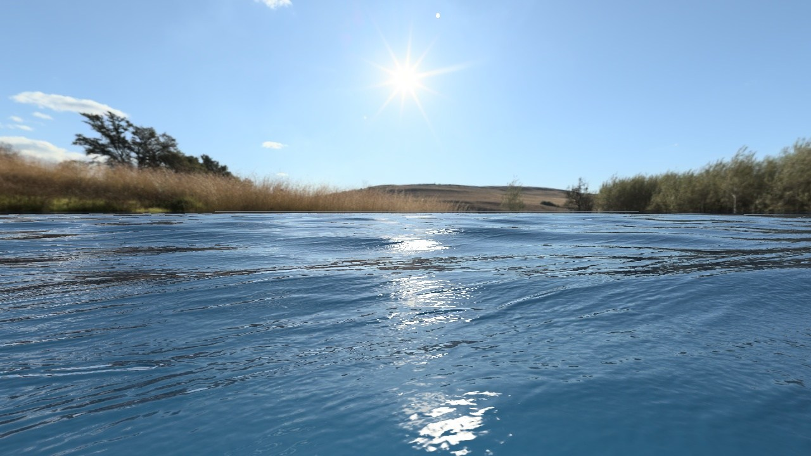
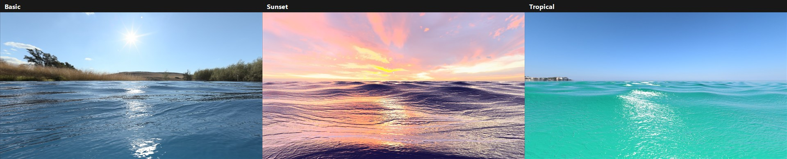
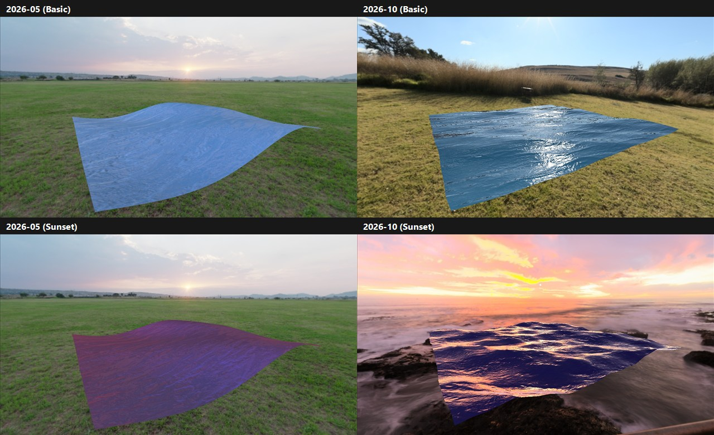
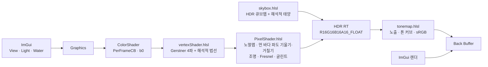

# WaterShader

> DirectX 11과 HLSL로 만든 물 셰이더입니다.




## 프로젝트 개요

"물을 표현하기 위해선 어떤 기능이 필요할까?"에서 출발한 프로젝트입니다. 그동안 당연하게 보던 물의 모습을 하나하나 뜯어보게 됐고, 그중 핵심이라고 느낀 네 가지를 구현했습니다.

- **물의 질감** : 잔물결은 노멀맵 두 장을 서로 다른 크기와 방향으로 흘려 겹쳤습니다. 한 장만 쓸 때 보이는 반복 무늬도 함께 줄었습니다.

- **물의 색과 반사** : 물은 내려다보면 속이 비치고, 수평에 가깝게 볼수록 하늘을 비춥니다. 프레넬(Fresnel) 효과로 보는 각도에 따라 이 둘의 비율이 바뀌게 했습니다.

- **물의 모양** : 바다의 물은 위아래로만 움직이지 않고 작은 원을 그리며, 그래서 마루는 뾰족하고 골은 넓습니다. 이 움직임을 Gerstner 파도 여러 개로 겹쳐 표현했습니다. 멀리 있어 메시로 표현할 수 없는 파도는 픽셀 단위의 기울기로, 그보다 작아지면 표면 거칠기(넓은 햇빛 반짝임)로 이어 그려 수평선까지 바람 방향이 유지됩니다.

- **빛** : 조명 값을 임의로 설정하지 않고 HDR 하늘에서 해의 방향, 색, 밝기와 주변광을 읽어 왔습니다. 하늘을 바꾸면 물에 닿는 빛도 함께 바뀝니다.

## 스크린샷

| | |
|---|---|
|  |  |
| **프리셋**: Basic / Sunset / Tropical (오션 그리드) | **업데이트 전후**: 2026-05 기존 버전 vs 2026-10 |
|  |  |
| **디버그 뷰**: 최종 / 노멀맵 / 월드 법선 / 조명 항 | **설정 창**: View [1] · Light [2] · Water [3] |

## 빌드와 실행

**요구 환경**: Windows 10/11, Visual Studio 2022 (C++ 데스크톱 개발), CMake 3.24+, [vcpkg](https://github.com/microsoft/vcpkg) (manifest 모드)

**의존성** (`vcpkg.json`에서 자동 설치): [DirectXTK](https://github.com/microsoft/DirectXTK) (DDS/WIC 로더), [Dear ImGui](https://github.com/ocornut/imgui) (win32/dx11 바인딩), [tinyobjloader](https://github.com/tinyobjloader/tinyobjloader) (OBJ 파서)

```powershell
git clone https://github.com/ryuhajin/WaterShader.git
cd WaterShader
$env:VCPKG_ROOT = "C:\path\to\vcpkg"      # vcpkg 설치 경로
cmake --preset vs2022
cmake --build --preset vs2022-debug       # Release는 vs2022-release
.\build\vs2022\Debug\WaterShader.exe
```

- 빌드 후 셰이더와 `assets/`가 실행 파일 옆으로 복사됩니다.
- **핫 리로드**: `shaders/`의 `.hlsl`/`.hlsli`를 저장하면 200ms 안에 다시 컴파일합니다. Debug 빌드는 소스 `shaders/`와 `assets/`를 직접 쓰고, Release 빌드는 실행 파일 옆 복사본을 읽습니다.
- Debug 빌드에서 `Save Current`를 누르면 저장소의 `assets/shader_presets.txt`가 바뀝니다. 프리셋은 작은 평면과 오션 그리드에 따로 저장되고, `Save Current`는 지금 보고 있는 평면 쪽에 저장합니다.

**명령줄 옵션** (캡처·측정용)

| 옵션 | 동작 |
|---|---|
| `--capture <label>` | 프리셋 3개 × 고정 샷 6개를 저장하고 종료 (무인 모드 포함) |
| `--capture-feature <name>` | 저장 위치 `docs/features/<name>/captures/<label>/` |
| `--preset-file <path>` | 프리셋을 이 파일에서 읽고 저장 (작업용 프리셋과 별개로 고정 값 캡처) |
| `--debug <0-6>` | 캡처할 디버그 뷰 (6 = 파도 구간: 메시 / 픽셀 / 거칠기) |
| `--shot <name>` | 시작 카메라 샷 (`oblique`, `top`, `sunward`, `ocean_surface`, `ocean_aerial`, `ocean_tele`) |
| `--far-waves <on\|off>` | 먼 바다 파도 기울기·거칠기 켜기/끄기 (비교용) |
| `--align-ripples <on\|off>` | 노멀맵 바람 정렬(Align to wind)을 프리셋 대신 지정 |
| `--ui <view\|light\|water\|all>` | 설정 창을 연 상태로 시작 |
| `--normal-a <i>` / `--normal-b <i>` | 레이어별 노멀맵을 프리셋 대신 지정 |
| `--normal-map <path>` | 추가 노멀맵 파일(두 레이어에 적용) |
| `--tonemap <none\|reinhard\|aces\|aces-hue>`, `--exposure <ev>` | 톤 커브·노출 덮어쓰기 |
| `--no-vsync` | FPS 제한 해제 (성능 측정) |
| `--no-input` | 무인 모드: 포커스를 가져가지 않고 키보드·마우스 입력을 무시 |

## 조작

| 입력 | 동작 |
|---|---|
| `W` / `S`, `A` / `D`, `E` / `Q` | 카메라 앞·뒤, 왼쪽·오른쪽, 위·아래 이동 |
| `←` `→` / `↑` `↓` | 카메라 좌우 / 상하 회전 |
| 마우스 왼쪽 드래그 | 벤치 평면 회전 (오션 그리드에서는 시점 회전) |
| 마우스 오른쪽 드래그 | 시점 회전 |
| `1` / `2` / `3` | View / Light / Water 설정 창 열기·닫기 |
| `Esc` | 종료 |

| 창 | 섹션 |
|---|---|
| **View Settings [1]** | Presets(Apply / Save Current), Camera, Camera Presets(고정 샷 6개 + 슬롯 4개), Scene(Ocean Grid, Skybox), Capture, Debug View |
| **Light Settings [2]** | Sky / Environment(하늘 선택, Calibrate From Sky), Sun(방향·색·세기), Sun Glint(날카로움·세기·먼 바다 확산 Far spread), Ambient, Tonemapping(커브·노출) |
| **Water Settings [3]** | Water Color, Reflection, Normal Map(레이어 A/B: 텍스처·바람 정렬·크기·흐름), Waves(Simple: 바람 방향·퍼짐·크기·높이·거칠기·속도로 파도 4개 생성 / Advanced: 파도 4개 개별 조정 / Far waves 토글) |

좌측 상단 Stats에는 FPS, CPU/GPU 시간, VSync 토글, 단축키 안내가 표시됩니다.

## 프로젝트 구조

```text
WaterShader/
├─ src/          # C++: D3D11·HDR 타깃, Graphics(UI·카메라·프리셋·캡처), 셰이더 래퍼(핫 리로드), GpuTimer, 로더
├─ shaders/      # vertexShader, PixelShader, skybox, tonemap + 공용 헤더 Common/Lighting/Cubemap/Color/Waves.hlsli
├─ assets/       # 벤치 평면 OBJ, 하늘(HDR BC6H)·노멀맵 5종 DDS, 프리셋·카메라 슬롯 txt
├─ tools/        # equirect_to_cube.ps1 — 파노라마 → 큐브맵 DDS + 태양·하늘 측정
│                # measure_normal_orientation.ps1 — 노멀맵 무늬 방향 측정 (Align to wind용)
├─ tests/        # wave_macro_test.cpp — Simple 파도 생성 규칙 검사 (WaveMacroTest)
└─ docs/         # 개요, 로드맵, 작업 규칙, 결정 기록, 기능별 SPEC/NOTES
```

## 향후 계획

- **Foam mask**: 파도 마루의 흰 거품
- **Waterfall**: 폭포 리본 메시와 가장자리 거품
- **Ripple SDF**: 시간에 따라 퍼지는 원형 물결
- **UE5 포팅**

## 구현 상세



## 업데이트 내역

2026-09 ~ 10에 진행한 버그 수정 17건과 퀄리티 업 12건은 [업데이트 내역](docs/CHANGELOG.md)에 증상·원인·해결과 기록 문서 링크로 정리했습니다.

## 문서

- [프로젝트 개요](docs/OVERVIEW.md) — 목적과 평가 포인트
- [로드맵](docs/ROADMAP.md) — 일정, 완료 목록, 앞으로 할 일
- [작업 규칙](docs/CONVENTIONS.md) — 문서 규칙과 기능 단위 브랜치 워크플로
- [기술 결정 기록](docs/decisions.md)
- [업데이트 내역](docs/CHANGELOG.md) — 버그 수정·퀄리티 업 기록
- [기능별 SPEC / NOTES](docs/features/)

## 참고 자료

- Schlick approximation (Fresnel) — *Real-Time Rendering* 4th, Ch. 9
- [GPU Gems Ch.1 — Effective Water Simulation from Physical Models](https://developer.nvidia.com/gpugems/gpugems/part-i-natural-effects/chapter-1-effective-water-simulation-physical-models) (Gerstner 파도, 법선)
- [Catlike Coding — Waves](https://catlikecoding.com/unity/tutorials/flow/waves/)
- [Krzysztof Narkowicz — ACES Filmic Tone Mapping Curve](https://knarkowicz.wordpress.com/2016/01/06/aces-filmic-tone-mapping-curve/)
- [DirectXTK Wiki](https://github.com/microsoft/DirectXTK/wiki)

## 에셋 출처

- **물 노멀맵** (`assets/textures/water_normal*.jpg`, 변환본 `.dds`) — [CADhatch Seamless Water Textures](https://www.cadhatch.com/seamless-water-textures) (무료 seamless 텍스처)
- **하늘 HDRI** (`assets/textures/env_*.dds`) — [Poly Haven](https://polyhaven.com/hdris) (CC0): `belfast_farmhouse`, `grasslands_sunset`, `the_sky_is_on_fire`, `spiaggia_di_mondello`
